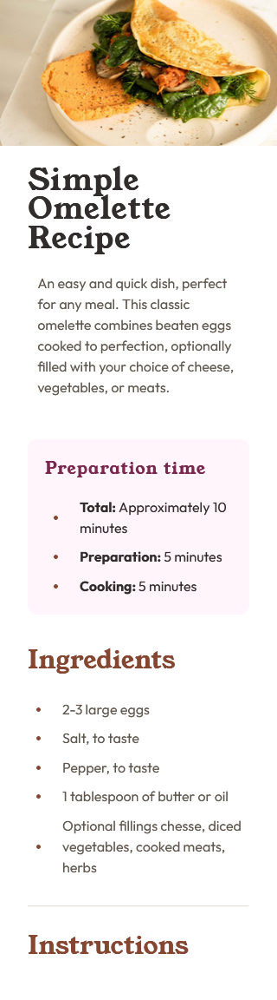
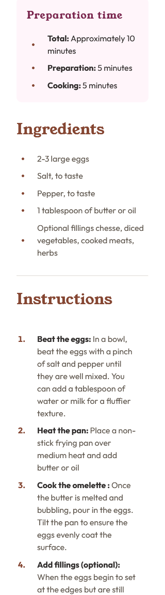
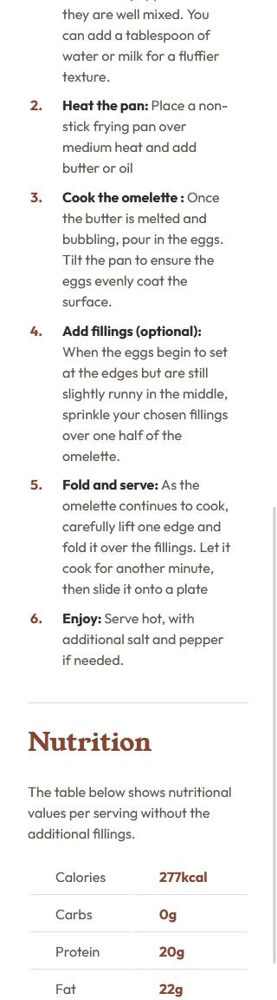

# Frontend Mentor - Recipe page

## Deploying your project

As mentioned above, there are many ways to host your project for free. Our recommend hosts are:

- [GitHub Pages](https://pages.github.com/)
- [Vercel](https://vercel.com/)
- [Netlify](https://www.netlify.com/)

## Got feedback for us?

We love receiving feedback! We're always looking to improve our challenges and our platform. So if you have anything you'd like to mention, please email hi[at]frontendmentor[dot]io.

# Frontend Mentor - Recipe page solution

This is a solution to the [Recipe page challenge on Frontend Mentor](https://www.frontendmentor.io/challenges/recipe-page-KiTsR8QQKm).

## Table of contents

- [Overview](#overview)
  - [Screenshot](#screenshot)
  - [Links](#links)
- [My process](#my-process)
  - [Built with](#built-with)
  - [What I learned](#what-i-learned)
  - [Continued development](#continued-development)
- [Author](#author)
- [Acknowledgments](#acknowledgments)
  

## Overview
Este es el primer reto fronted en el que me he tenido que esforar para completar  **La página de recetas principal.

Es un proyecto en el que debes utilizar las unidades relativas para hacer un diseño responsive. Así como otras técnicas de diseño.

### Screenshot

### Links

- Solution URL: [Add solution URL here](https://github.com/juan-mentor/recipe-page-main-new.git)
- Live Site URL: [Add live site URL here](https://juan-mentor.github.io/recipe-page-main-new/)

## My process
Esta vez no he sido lo suficientemente disciplinado y no he escrito el Css de forma correcta y ordenada.

Pienso que es el proyecto más largo que he hecho y no tengo claro como organizarme, ni en que debo fijarme primero. He de decir que me he liado un poco y quizás tenga alguna incosistencia y algo de código repetido.

Me he centrado demasiado en el diseño móvil sin tener en cuenta que modificaciones debía hacer en el diseño ordenador. Lo que me ha hecho perder tiempo y perderme un poco con los estilos.

### Built with

- Semantic HTML5 markup
- CSS custom properties
- Mobile-first workflow

### What I learned

He empezado a comprender los pseudoelementos y a manejar los iconos del pseudoelemnto `::marker` de los list-items.

### Continued development

Me gustaría saber que propiedades se pueden utilizar en el pseudoelemto `::marker` y por que no funciona position para modificar la posición de sus iconos.

## Author

- Frontend Mentor - [@yourusername](https://www.frontendmentor.io/profile/juan-mentor)